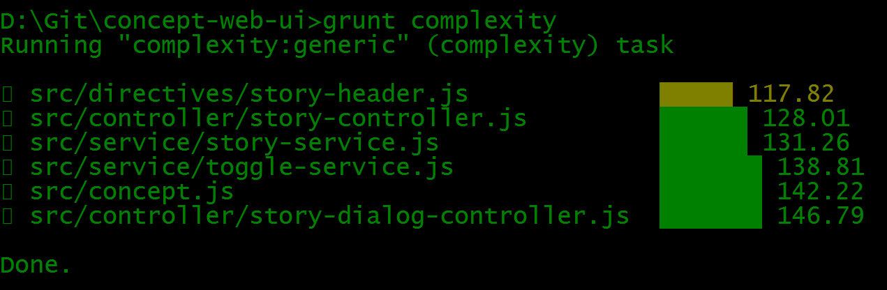

# Welcome to the concept web-ui repository

[](https://travis-ci.org/Nachtfeuer/concept-web-ui) 

### Table Of Content
[**Introduction**](#introduction)  
[**Consider some data**](#consider-some-data)  
[**The first steps**](#the-first-steps)  
[**More columns and sorting**](#more-columns-and-sorting)  
[**Adding searching/filtering**](#adding-searchingfiltering)  
[**Expand and collapse for individual stories**](#expand-and-collapse-for-individual-stories)  
[**Expand and collapse for all stories and labels**](#expand-and-collapse-for-all-stories-and-labels)  
[**Story service**](#story-service)  
[**Directive for a column header**](#directive-for-a-column-header)  
[**Using Bower**](#using-bower)  
[**npm packages, ngdocs and grunt**](#npm-packages-ngdocs-and-grunt)  
[**Unit tests and code coverage**](#unit-tests-and-code-coverage)  
[**A dialog for the story**](#a-dialog-for-the-story)  
[**Displaying a statistic**](#displaying-a-statistic)  
[**Options dialog**](#options-dialog)  
[**Complexity Report**](#compexity-report)  

## Introduction
It's about playing with AngularJS, jQuery, Bootstrap and similar.
Also for myself I would like to have a - hopefully - quite nice
example where technologies are combined in simple examples.

With the intention of high quality I'm using separation as
much as possible, documentation of the source and this readme
with all required information that anybody - including me -
can take parts of the examples to use it for something else.

I'm trying to add additional documentation here:

 * [AngularJS](docs/AngularJS.md)
 * [Bootstrap](docs/Bootstrap.md) -- not yet added
 * [npm, bower and grunt](docs/Tools.md)

## Consider some data
First let us consider some data we would like to visualize.
Let us take stories and tasks as data with following definitions:

* A story can have an unlimited number of tasks.
* Each story and each task has an id and a title
* The story id's should be unique
* The id's of the tasks should be unique inside the given story.
* Each task has one of following states: **todo**, **wip** and **done**.
* Each task has one of following complexities: **easy**, **moderate**, **difficult** and **unknown**
* Each task has one of following effort levels: **soon**, **days**, **weeks**, **unknown**.
* Each story can have a description while task titles should be sufficient.
* Each story may have one of following priorities: **crititcal**, **urgent**, **normal** and **nice to have**.
* Each story can have labels (list of texts)

As a start those definitions should be sufficient. With this I'm going to write a JSON file.
You can see current stories and tasks in the file **data.json**.

## The first steps
You require an index.html. Just a few lines an AngularJS and Bootstrap are known there.
Of course there are tools to organize that all those dependencies are installed
locally but as a start you can live without accessing the dependencies in the web.

Next you require the module (application) and at least one controller. The module
you find in **concept.js** and the controller in **story.js**. Ensure that you include
it in your index.html in that order.

The story controller is very simple. You load the JSON and assign it to the controller field.
You have to use the apply mechanism as you can see there.

The table has finally just one data row definition with the attribute **ng-repeat**
where you define the loop "for element in list" which looks similar as in many other languages.

The class definition from Bootstrap are doing most for you. The documentation is really
good so have a look what the **container**, **table** and **page-header** provide you
looking at http://getbootstrap.com/css/.

When writing this section the index.html has less than 40 lines of code.
The result was this:


## More columns and sorting

I don't show yet tasks (comes later) but following columns could be added because we have the data:

* The number of tasks per story.
* Showing the state of the story by calculating it.
* Showing the percentage of completion.

In addition I can adjust the default sorting to the id (ascending order) but allow clicking
each column header to sort by this one and clicking same column header twice toggles between
ascending and descending order. The result was this:


## Adding searching/filtering

The next step is to add a **searching/filtering capability** and that's using the
filter Functionality provided by AngularJS.

Again Bootstrap does help that the filter input looks quite nice. In addition I add a further column
that calculates the complexity. Here some thoughts to it:

* I internaly adjust "easy" to 2, "moderate" to 8 and "difficult" to 13 (taken from fibonacci sequence)
* Story with three tasks: one easy, one moderate and one difficult is (2+8+13)/3 is ~ 7 => nearest value is 5 so the average complexity will be moderate.
* Story with three tasks: two easy, 1 difficult: (2*2+13)/3 is ~ 5 so average complexity will be moderate
* For unknown complexity I take 144 (also from fibonacci sequence). Of course I assume that stories are kept as small as possible. If the story has more than one difficult task you probably should consider to breakdown the story into two or even more stories. Unknown complexity anyway should enforce that too.

The result was this:


## Expand and collapse for individual stories

It's now time to show/hide the tasks. Basically I use same row used for the story for displaying
the tasks. A dictionary remembers for each story the expand/collapse state. The advantage of this
design is that it is easy to implement and that sorting and filtering still work fine with this.
The basic AngularJS mechanism used for it is **ng-show**.

The result was this:


## Expand and collapse for all stories and labels

Of course all stories should be expandable/collapsable in one step; therefore I place a icon in the outer left cell of the column header. The **ng-show** depends on a scope variable remembering current toggle state and a scope function **toggleAllStories** does the job (really easy). The labels I simply put after the title since there is enough space. I also tested to print and I have seen that the search form would have been printed; that's why I put a class attribute **hidden-print** at the form (see Bootstrap).

The result was this:


## Story service

The **story.js** (controller) has getting a bit long. There are three story functions which do not depend on $scope which are:

* getState
* getAverageComplexitiy
* getPercentageDone

I'm moving that into a service (**story-service.js**) which is told to behave like
a singleton in AngularJS. The important detail you have to know: you have to pass
the service name in single quotes afther $scope variable and then without the quotes
as parameter in the function:

```
angular.module('concept').controller('StoryController', ['$scope', 'Story', function($scope, Story) {
```

Since I also would like to use the functions in the HTML I simpy reference them in the controller:

```
    // service functions
    $scope.getState = Story.getState;
    $scope.getPercentageDone = Story.getPercentageDone;
    $scope.getAverageComplexity = Story.getAverageComplexity;
```

That's all. The controller is now significant smaller.

## Directive for a column header

I have to say that this topic has been a bit of pain. Also it was clear to me how the idea is the
problems were hidden somewhere in the details. Have a look at **story-header.js**. Finally I 
were able to define a header likes this

```
<th th-story title="Title" key="title" reverse-order="reverseOrder" sort-key="sortKey"></th>
```

Just to remember: The original code (see after here) is about changing the sort key
as well as the sorting order when you click the same colum header again. The now hidden
code is this one (specific for the title column):

```
<a href="#" ng-click="sortKey = 'title'; reverseOrder = !reverseOrder">
    <span ng-show="sortKey == 'title' && !reverseOrder" class="fa fa-caret-down"></span>
    <span ng-show="sortKey == 'title' &&  reverseOrder" class="fa fa-caret-up"></span>
    Title
</a>
```

The first two value are configure to be just input. The other value are configure that they
can be overwritten. When you click on the header the sorting toggles between ascending and
descending order and it also sets the sort key to the given column.

Usually when displaying the title you can do it immediately so you use `{{title}}`. But using
the `ng-click` and `ng-show` attribute you have late evaluation so you leave away the curly brackets.

After I have found out that details the task were basically done. So the directive doesn't look
difficult.

Please also keep in mind not to use same model as the app. I'm using here `ConceptDirectives` and
you have to register it as the application (see **concept.js**).

## Using bower

Of course all dependencies should be kept locally when you are going to deploy your static files on a server.
Therefor `bower` is the commonly used tool. You install it with:

```
npm install -g bower
```

You then can define a simple `bower.json` where you define the package name as well as the dependencies
and its version. Then you simply call:

```
bower install
```

I like to have a different name for those dependencies as used as default; therefor I added a `.bowerrc`
in the root of the project specifying another folder.

Finally I did have to change the url's now refering to a relativ local path:

```
<!-- CSS -->
<link rel="stylesheet" href="deps/bootstrap-css/css/bootstrap.min.css">
<link rel="stylesheet" href="deps/font-awesome/css/font-awesome.min.css">

<!-- Libraries -->
<script type="text/javascript" src="deps/jquery/dist/jquery.min.js"></script>
<script type="text/javascript" src="deps/angularjs/angular.min.js"></script>
```

## npm packages, ngdocs and grunt

Of course I would like to have a nice HTML documentation like Javadoc or Doxygen.
There is a way to achieve it using ngdocs. You have to maintain some
config files to make it happen:

* The **package.json** - From last section you already know that **bower** is required. With this section **grunt-cli** and **ngdocs** will be added (just look at the file).
* **Gruntfile.js** - That's the config file for the task runner. There's a task for ngdocs and one for cleanup.

The only thing to do then:

```
grunt
# or
grunt clean
# or
grunt ngdocs
```

After that you have under build/docs/index.html the HTML Documentation for your files. The Gruntfile.js of this project is really easy to understand how it works. I have not done it but there is also module available (connect) that a server runs for you so you could see the docs at http://localhost:8080/docs.

For the documentation (markdown) just have a look at current Javascript files.

## Unit tests and code coverage

Unit tests and code coverage are important tools that you are able to detect problems before a
user/customer is detecting it. Some additions I made to the project with this section:

 * Using **Karma** as test runner.
 * **Jasmine** and **PhantomJS** added for headless testing.
 * Added unittests for the story service (getState, getPercentageDone and getAverageComplexity).
 * Added unittests for the story header directive.
 * HTML code coverage report added.
 * Using angular-mocks for testing the own AngularJS service.
 * JSHints added to have some Javascript checker in place.


The code coverage looks like this. When you click on the file you see how often each line has been called
and a line that has not been called would be red. Also you can see branch coverage which means you can
see when any if/else path has been missing in your test.


## A dialog for the story

Using `ng-dialog` a dialog is quite easy to implement. However - more and more - I will have to
provide my own style in addition to the existing one because:

* The dialog is not wide enough.
* There is no spacing between the labels and the table.
* A dialog border would be nice as you can see in the demo of `ng-dialog`.

For the moment the dialog content is just readonly.


## Displaying a statistic

Using `Bootstrap` I display a simple statistic panel at top right:

* Overall number of stories
* Overall number of tasks.
* Overall number of tasks per state with different colors.


## Options dialog

Also using `ng-dialog` I'm now displaying global options. When changing one of them it has
immediate reaction. You can do following:

* Show/hide of done stories
* Show/hide of done tasks
* Show/hide of story labels

In addition I adjusted the dialog with a border and organize the close button to fit with it.
Basically I'm overwriting the default theme (a bit). The options dialog is extracted as a
so called partial template. With `ng-include` it's included into the HTML.


## Complexity report

It's also important to check the complexity of the Javascript files. There are
mainly two criteria:

 * **cyclomatic complexity** - number of distinct paths in your function
 * **halstaedt** - it's about the number of operators and operands in your function
 * **maintainability index**

**Please read here**: https://github.com/philbooth/escomplex/blob/master/README.md#metrics




## Some jsfiddle links
 - https://jsfiddle.net/gtb05ud7/6/
 - https://jsfiddle.net/8qa6q9ek/6/
