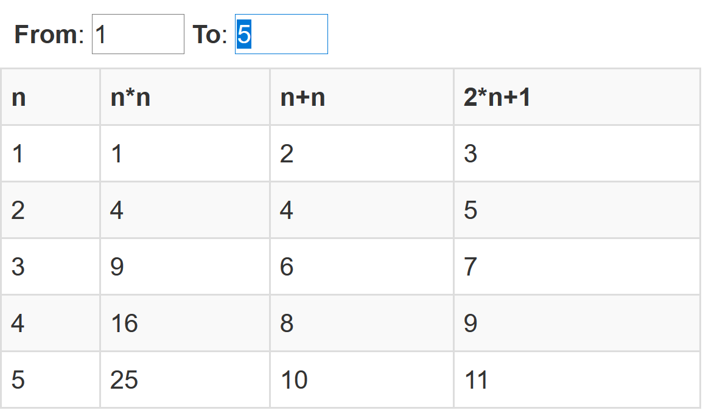

## Welcome to my own AngularJS FAQ

### Table Of Content
[**Introduction**](#introduction)  
[**How to write a simple application?**](#how-to-write-a-simple-application)  
[**How to write a simple controller?**](#how-to-write-a-simple-controller)  
[**How to use a simple controller?**](#how-to-use-a-simple-controller)  
[**How to organize simple searching and filtering?**](#how-to-organize-simple-searching-and-filtering)  
[**How to do a simple sorting?**](#how-to-do-a-simple-sorting)  

## Introduction

Basically I would like to have all together in this project
with details and links for easier searching and navigating.
The example does use the external resources via CDN.

## How to write a simple application?

The relevant HTML part is
```
<html ng-app="simple">
```

Usually you would write a `simple.js` to implement the module;
for the demo I put everything into one file:

```
angular.module('simple');
```

Have a look at [simple.html](examples/simple.html)!

## How to write a simple controller?

```
angular.module('simple').controller("SimpleController", ['$scope', function($scope) {
    $scope.data = [ "one", "two", "three"];
}]);
```

Have a look at [simple.html](examples/simple.html)!

## How to use a simple controller?

```
<div ng-controller="SimpleController">
    <span ng-repeat="entry in data"> {{entry}}</span>
</div>
```

The output is then "one two three".
Have a look at [simple.html](examples/simple.html)!

## How to organize simple searching and filtering?

Reusing the example in simple.html you can simply add `$scope.search = ''` in the
controller and then adding in `ng-repeat` the search filter as shown. The input
widget is connected to the controllee field `search` by using `ng-model`.

I also added some more values (one to ten). Just type one character
(example: an `e` or a `t`) to see the effect immediately.

```
<b>Search</b>: <input type="text" ng-model="search" autofocus><br/>
<span ng-repeat="entry in data | filter:search"> {{entry}}</span>
```

Have a look at [simple-search-and-filter.html](examples/simple-search-and-filter.html)!

## How to do a simple sorting?

The most simple scenario is sorting a list of strings.
Using the example from searching and filtering you simply can
use `orderBy` with `toString()` as shown.

```
<span ng-repeat="entry in data | orderBy:'toString()' | filter:search"> {{entry}}</span>
```

The initial output is then "eight five four nine one seven six ten three two".
Have a look at [simple-sort.html](examples/simple-sort.html)!

## How to write an own filter?

Basically you write function with following rule for its parameters:

* The first parameter is the container
* The second parameter is the first parameter when you say: `myfilter:param1`
* The third parameter is the second parameter when you say: `myfilter:param1:param2`
* Same for further parmeters (if you want to have them)
* Each of those parameter (except first one) is a string you might have to call a parse function to convert.

The filter for an integer number range would be following:

```
angular.module('simple').filter('range', function() {
    return function(items, fromValue, toValue) {
        toValue = parseInt(toValue);
        for (var value=parseInt(fromValue); value <= toValue; ++value) {
            items.push(value);
        }
        return items;
    }
});
```

You use that inside of HTML like this (for the result see the screenshot):
```
<tr ng-repeat="n in [] | range:fromValue:toValue">
    <td>{{n}}</td><td>{{n*n}}</td><td>{{n+n}}</td><td>{{2*n+1}}</td>
</tr>
```

The variables `fromValue` and `toValue` are - of course - fields of the controller.
You should have seen that already from the example with the search field.

Have a look at [math-table.html](examples/math-table.html)!

